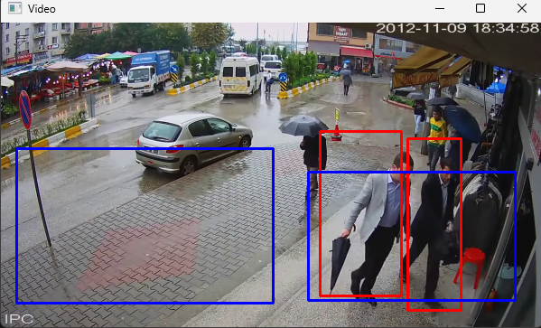

# Detecting persons and capturing their images if they fall in ROI.

**Problem Statement**
- A JSON file contains normalized coordinates for two regions of interest(ROI). ie. Sideways and Entry
- A video file of pedestrians moving about in an area.

**Methodology**

A JSON file was given containing two regions of interest Sideways and Entry. A bounding box was to be made in both ROI’s . The normalized coordinates were given in the JSON file. It was to be denormalized by multiplying x-coordinate with width and y-coordinate with height of the video.

I used HOGDescriptors to extract the features from the video and a deep neural network of opencv to detect the people present in the video. And whenever the person was inside of the bounding box the model captures the person's picture and saves it in a directory.

**Results**
- It builds a bounding box in the sideways and entry coordinates
- It detects the person and whenever the person falls in ROI then it captures the image

**How to Run**
- clone this repo.
- run "python main.py"

**Sample Output**

